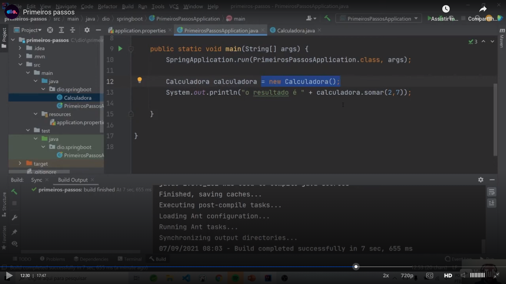
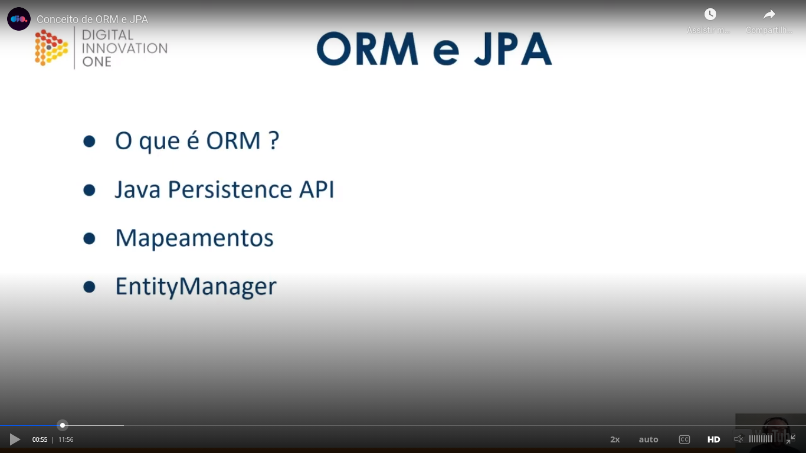
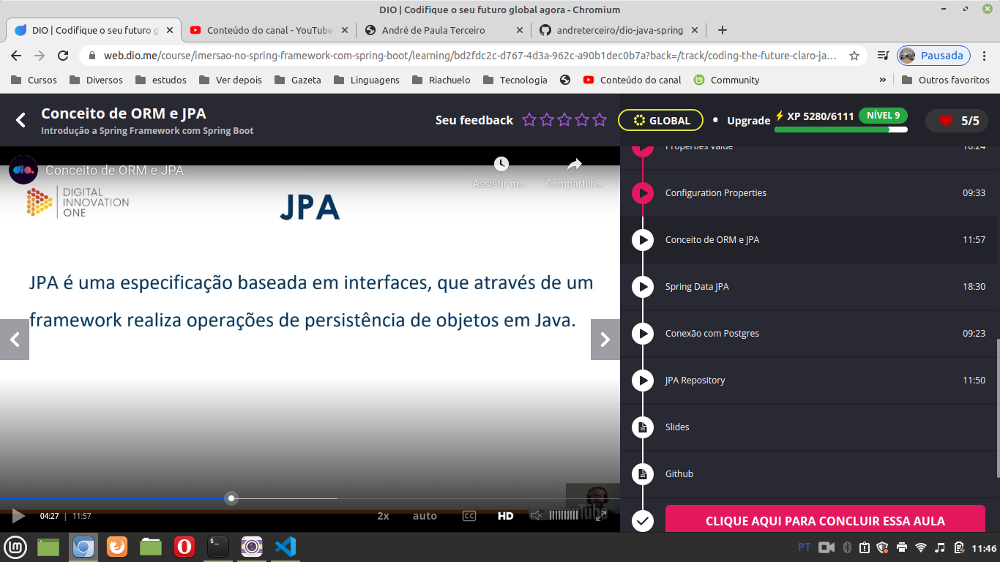
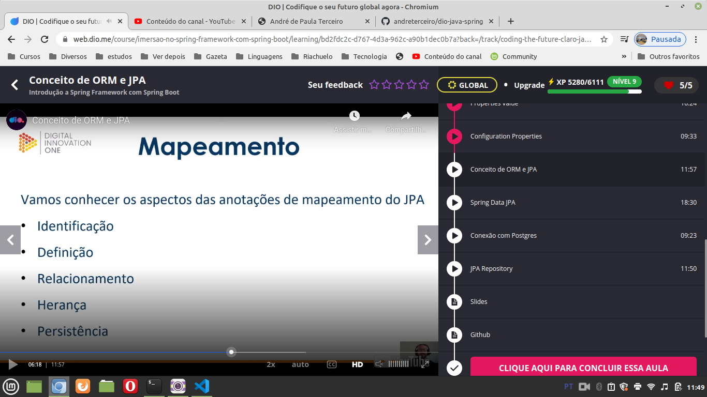
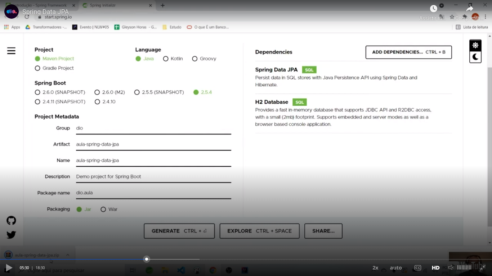
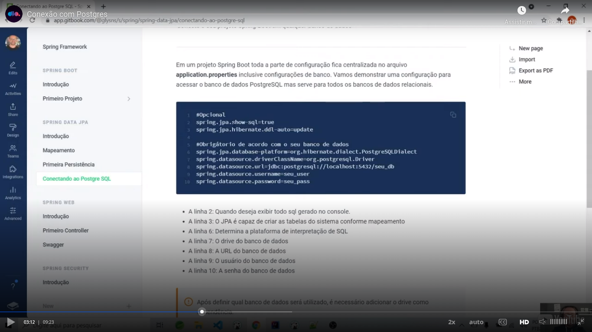
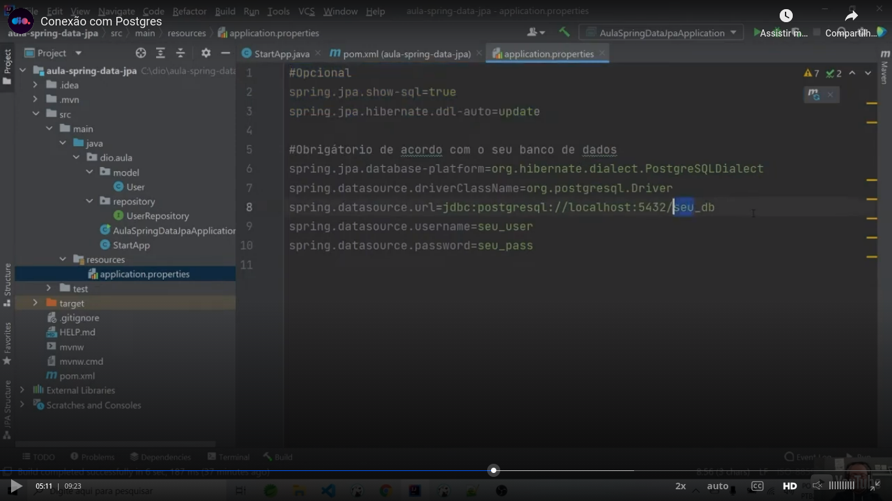
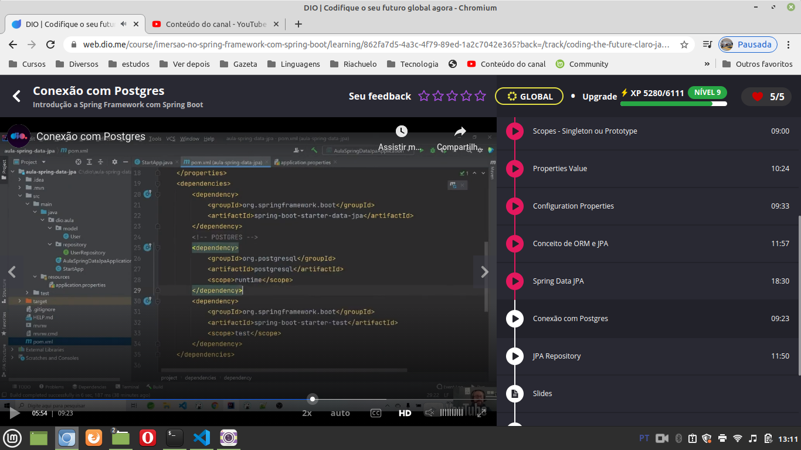
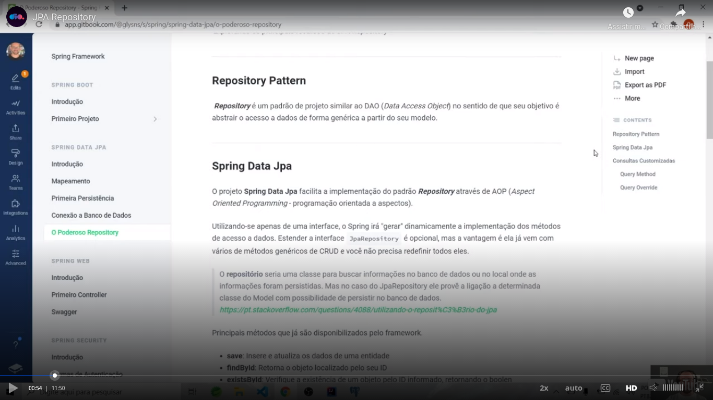

# General

Spring framework is an Java open source framework based on the concepts of `inversion of control` and `dependency inversion`.

Your structure is based on modules.

Overview of modules:

Java EE mainly in version preview of 5 was very verbose and burocratic and Spring Framework born as a more simple solution.

## Some concepts of Spring Framework

### IOC

Overview:

Traditional way to work without IOC:

With IOC:

### Dependency injection

Overview:

### Beans

### Scopes

More details:

- **Singleton**: the IOC container creates only one instance of the object;
- **Prototype**: it will be created a new object on each request to the container;
- **HTTP - request**: a bean will be created to each HTTP request;
- **HTTP - session**: a bean will be created to each user session;
- **HTTP - global**: application scope creates a bean to the context lifecycle of the application. In other words, while the application works, this bean will be avaliable.

### Autowired

Overview:

## Spring boot

Overview:

Before Sprint Boot:

The role of Spring Boot is to aid in the configuration step. `Dependency injection` and `inversion of control` are concepts more related to Spring Framework, not to Spring Boot. The general idea is let you to put focus on the things related to the business.

Starters:

Starters are dependency descriptors. In the previous image, in the left part, please see the comments in green. To me (my comment and not a comment of the teacher, the left part of the image seemed a part of a `pom.xml` of Maven). In the right part is showed a more easy way to do the same thing using a starter. As you can see in the right part of the image, the `Spring Boot` is used in the right part of the image.

Benefits:

- Cohesion;
- Compatibles versions;
- Optimization of time;
- Simple configuration;
- Focus on business.

Some starters:

More starters:

## Creating a simple Spring Boot project

Basic steps:

* `"initializr"` is also known as Spring Initializr.

Site: [https://start.spring.io/](https://start.spring.io/)

We generated this starter there:

I had to generated a little different starter because some version change between my generation and the generation of the teacher while he was recording the class:

I versioned the generated starter with the name `generated-initializer.zip` in the root directory. I extracted this zip file with the name `project-generated-with-initializer`, also in the root directory.

To run this project, see the file and the run button that I pressed in VSCode in the next image:

We made a simple `Calculadora` class that we stored in the root directory of the package who has a simple "somar" method that add two integers. This is the wrong strategy to use this class, insatantiating manually the class. The class is not avaliable in the "Spring world" using dependency injection ans inversion of control. See:

## Using Spring

Please see [this video](https://youtu.be/bSrLs8Yx5cw).

## Singleton x prototype

[Class](https://web.dio.me/course/imersao-no-spring-framework-com-spring-boot/learning/13a57341-f406-463b-ac6c-037a08d8ee2f?back=/track/coding-the-future-claro-java-spring-boot&tab=undefined&moduleId=undefined)

As I need to be more quick in my studies, I recorded [this video](https://youtu.be/kovC2AcR05M) trying to save some time.

## application.properties

Intruductory [slide](images/application-properties.png).

The teacher talked about application.properties when he talked about providing some values to the application.

He talked also that this is used when we will not have change in the values.

My video talking about this class: [video](https://youtu.be/KP2kOnCCHjM).

## Configuration properties

In [this class](https://web.dio.me/course/imersao-no-spring-framework-com-spring-boot/learning/76c0fe87-be0c-40cd-8028-91025f00882b?back=/track/coding-the-future-claro-java-spring-boot&tab=undefined&moduleId=undefined) the teacher also talked about the use of `application.properties`, but through a ** bean** in this case. See [my understainding](https://youtu.be/aMD_b5hscQo) of this class.

## JPA - Java Persistence API

Some keywords:

Definition of JPA:

JPA - mapping:

I made a [video](https://youtu.be/7ZGD9HBcgKo) about this class.

## Spring data JPA

We will talk about interfaces and methods.

Here teacher used [Spring Initializr](http://start.spring.io) to generate the project with the dependencies to use Spring Data JPA, see:

Pay attention that he both added the dependency of JPA as the dependency related to the RDBMS, in this case HS, but he could added the depenedency for MySQL or PostegreSQL if he wanted.

I recorded [this video](/home/andre/Área de Trabalho/spring-data-jpa.mp4) about this class.

## Using PostgreSQL

Teacher configured some details of the connection with the PostgreSQL database in `application.properties`:

In the previous image you can see how JPA made the "magic" of updating the relational side with updating the Spring side.

The configurations that teacher get from the previous slide he pasted in `application.properties`:

Teacher also inserted the PostegreSQL dependency in `pom.xml`, but he can added this dependency when he generated the basic project in Initializr:

I made [this video](https://youtu.be/f-1qoG5xMoY) about this class.

## JPA repository

Teacher teached us that `Repository` is similar to `DAO` (`D`ata `A`ccess `O`bject), see:

When we use the connection with a table in a "JPA world", we use AOP (aspect oriented programming, please see the result in Google, as example [this link](https://www.devmedia.com.br/programacao-orientada-a-aspectos-com-o-spring-framework-2-0/6781)). We will use annotations. and when implement some interfaces we will can use some methods, like:

- save();
- findById();
- count();
- delete();
- and others.
