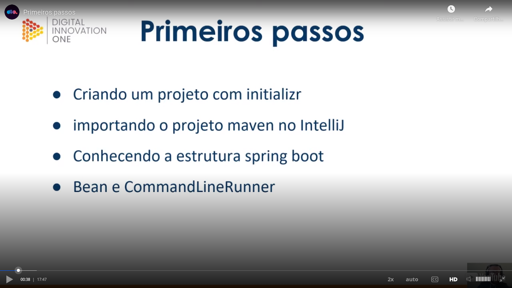

# General

Spring framework is an Java open source framework based on the concepts of `inversion of control` and `dependency inversion`.

Your structure is based on modules.

Overview of modules:

Java EE mainly in version preview of 5 was very verbose and burocratic and Spring Framework born as a more simple solution.

## Some concepts of Spring Framework

### IOC

Overview:

Traditional way to work without IOC:

With IOC:

### Dependency injection

Overview:

### Beans

### Scopes

More details:

- **Singleton**: the IOC container creates only one instance of the object;
- **Prototype**: it will be created a new object on each request to the container;
- **HTTP - request**: a bean will be created to each HTTP request;
- **HTTP - session**: a bean will be created to each user session;
- **HTTP - global**: application scope creates a bean to the context lifecycle of the application. In other words, while the application works, this bean will be avaliable.

### Autowired

Overview:

## Spring boot

Overview:

Before Sprint Boot:

The role of Spring Boot is to aid in the configuration step. `Dependency injection` and `inversion of control` are concepts more related to Spring Framework, not to Spring Boot. The general idea is let you to put focus on the things related to the business.

Starters:

Starters are dependency descriptors. In the previous image, in the left part, please see the comments in green. To me (my comment and not a comment of the teacher, the left part of the image seemed a part of a `pom.xml` of Maven). In the right part is showed a more easy way to do the same thing using a starter. As you can see in the right part of the image, the `Spring Boot` is used in the right part of the image.

Benefits:

- Cohesion;
- Compatibles versions;
- Optimization of time;
- Simple configuration;
- Focus on business.

Some starters:

More starters:

## Creating a simple Spring Boot project

Basic steps:

* `"initializr"` is also known as Spring Initializr.

Site: [https://start.spring.io/](https://start.spring.io/)

We generated this starter there:

I had to generated a little different starter because some version change between my generation and the generation of the teacher while he was recording the class:

I versioned the generated starter with the name `generated-initializer.zip` in the root directory. I extracted this zip file with the name `project-generated-with-initializer`, also in the root directory.

To run this project, see the file and the run button that I pressed in VSCode in the next image:

